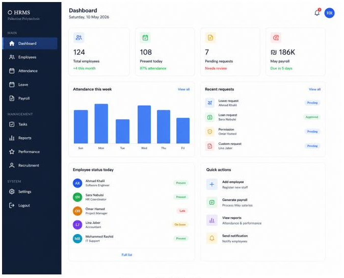
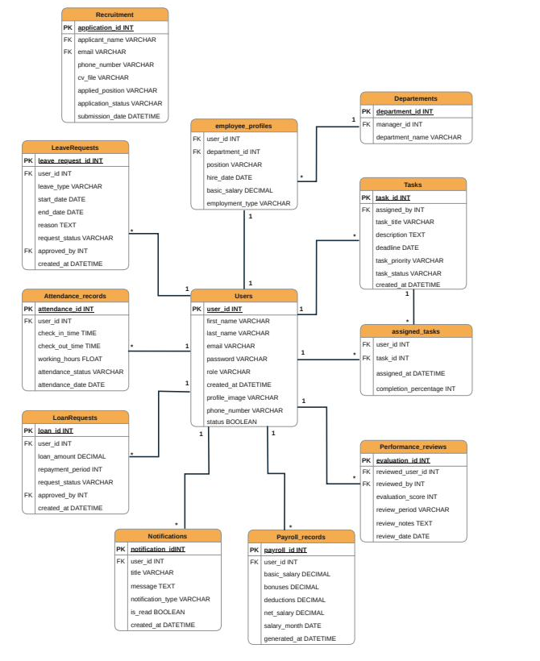

<div align="center">


# Human Resource Management System (HRMS)

**Graduation Project — Palestine Polytechnic University**
College of Information Technology and Computer Engineering · Department of IT and Computer Science

[](https://nestjs.com/)
[](https://www.typescriptlang.org/)
[](https://www.mysql.com/)
[](https://www.docker.com/)
[](https://jwt.io/)
[](https://swagger.io/)

[]()
[]()

</div>

---

## 📖 عن المشروع

**HRMS** هو نظام إدارة موارد بشرية حديث، مصمم ليكون بديلاً بسيطاً وفعّالاً وبأسعار معقولة عن الأنظمة العالمية المعقدة (Workday, SAP SuccessFactors) للشركات الصغيرة والمتوسطة.

النظام بيغطي دورة الموظف الكاملة: من التقديم على الوظيفة، لإدارة الحضور والانصراف، الإجازات والسلف، تقييم الأداء، وحتى احتساب الرواتب — بواجهة بسيطة وسهلة الاستخدام.

---

## 👥 فريق العمل

| الاسم | الرقم الجامعي | الدور |
|---|---|---|
| **Hosam Tarade** | 231102 | Backend Developer |
| **Mohammed Tarade** | 231101 | Backend Developer |
| **Bahaa Zahedah** | 231114 | Backend Developer |

**المشرف:** Dr. Hani Salah

---

## 🖼️ لمحة عن النظام

<div align="center">

<p><em>تصميم واجهة لوحة التحكم (Dashboard) — من مستند التصميم</em></p>
</div>

---

## 🏗️ التقنيات المستخدمة (Tech Stack)

| الطبقة | التقنية |
|---|---|
| **Backend** | NestJS + TypeScript |
| **Database** | MySQL + TypeORM (Migrations) |
| **Authentication** | JWT (Access + Refresh Tokens) |
| **Authorization** | Role-Based Access Control (RBAC) |
| **API Documentation** | Swagger / OpenAPI |
| **Security** | Helmet, Rate Limiting (Throttler) |
| **Containerization** | Docker + Docker Compose |
| **API Testing** | Postman + Swagger UI |
| **Frontend** *(مخطط له)* | ReactJS + Bootstrap |

---

## 👤 أدوار المستخدمين

النظام بيدعم 4 أدوار بصلاحيات متدرجة:

```
Applicant  →  Employee  →  Manager  →  HR Admin
```

- **Applicant** — يقدّم على وظائف ويتابع حالة طلبه
- **Employee** — يدير بياناته الشخصية، الحضور، الطلبات، والمهام
- **Manager** — كل صلاحيات Employee + الموافقة على الطلبات ومتابعة الفريق
- **HR Admin** — صلاحية كاملة على النظام (إدارة الموظفين، الرواتب، التوظيف، الأدوار)

---

## 🗄️ تصميم قاعدة البيانات (ERD)

<div align="center">

</div>

---

## 📦 الموديولات (حسب خطة العمل)

- [x] **Setup** — NestJS, MySQL, TypeORM, Docker, Auth Base
- [x] **Authentication & Users** — JWT, Refresh Tokens, Guards, Roles
- [x] **Department Management** — CRUD + RBAC
- [x] **Attendance Management** — Check-in/Check-out, حساب ساعات العمل تلقائياً، منع التكرار اليومي
- [x] **Employee Management** — إنشاء موظف (User + Profile) بعملية Transaction واحدة، Soft Delete
- [x] **Requests** — جدول موحّد لطلبات (Leave/Loan/Permission/Custom) بسير موافقة كامل
- [x] Recruitment
- [x] Task Management
- [ ] Payroll Management
- [ ] Performance Evaluation
- [ ] Notifications
- [ ] Reports & Analytics
- [ ] RBAC — مراجعة نهائية شاملة

---

## 🛡️ ممارسات الجودة والأمان (Best Practices)

بالإضافة للموديولات الأساسية، تم تطبيق مجموعة من الممارسات الاحترافية على مستوى المشروع كامل:

| الميزة | الوصف |
|---|---|
| **TypeORM Migrations** | تتبع تغييرات قاعدة البيانات بملفات مرقّمة بدل الاعتماد على `synchronize` التلقائي |
| **Global Exception Filter** | كل الأخطاء ترجع بشكل موحّد: `statusCode`, `message`, `path`, `timestamp` |
| **Global Validation Pipe** | تحقق تلقائي وصارم من كل البيانات الواردة عبر DTOs |
| **Response Interceptor** | كل الردود الناجحة موحّدة الشكل: `{ success, data, timestamp }` |
| **Swagger / OpenAPI** | توثيق تفاعلي كامل لكل الـ Endpoints |
| **Helmet** | رؤوس أمان HTTP قياسية لحماية من الهجمات الشائعة |
| **Rate Limiting** | حد عام 10-20 طلب/دقيقة، وحد أشد (5 طلبات/دقيقة) على `/auth/login` لمنع Brute Force |
| **RBAC** | حماية كل Endpoint حساس بالدور المناسب عبر `@Roles()` + `RolesGuard` |
| **Transactional Operations** | عمليات حساسة (مثل إنشاء موظف) تتم ضمن Database Transaction لضمان تناسق البيانات |
| **Soft Delete** | تعطيل الحسابات بدل الحذف الفعلي، للحفاظ على البيانات التاريخية المرتبطة |
| **Ownership-based Filtering** | كل مستخدم يشوف بياناته الخاصة بس (ما لم يكن Manager/HR Admin) |

---

## 🚀 التشغيل محلياً

### المتطلبات
- [Node.js](https://nodejs.org/) (v18 أو أحدث)
- [Docker Desktop](https://www.docker.com/products/docker-desktop/)

### الخطوات

```bash
# 1. استنساخ المشروع
git clone https://github.com/Hosamtarde/HRMS.git
cd HRMS/backend

# 2. تركيب الحزم
npm install

# 3. إعداد متغيرات البيئة
cp .env.example .env

# 4. تشغيل قاعدة البيانات (MySQL + phpMyAdmin)
docker compose up -d

# 5. تشغيل الـ Migrations (بناء الجداول)
npm run migration:run

# 6. إضافة مستخدمين تجريبيين (HR Admin + Employee)
npm run seed

# 7. تشغيل السيرفر
npm run start:dev
```

| الخدمة | الرابط |
|---|---|
| **API** | `http://localhost:3000` |
| **توثيق Swagger التفاعلي** | `http://localhost:3000/api/docs` |
| **phpMyAdmin** | `http://localhost:8080` |

### 🔑 حسابات تجريبية (بعد `npm run seed`)

| الدور | Email | Password |
|---|---|---|
| HR Admin | `admin@hrms.com` | `admin123` |
| Employee | `employee@hrms.com` | `employee123` |

---

## 🗃️ التعامل مع قاعدة البيانات (Migrations)

المشروع يستخدم **TypeORM Migrations** بدل التوليد التلقائي للجداول. أي تغيير على شكل قاعدة البيانات يجب أن يمر بهالخطوات:

```bash
# بعد إضافة/تعديل أي Entity
npm run migration:generate -- src/migrations/اسم-وصفي-للتغيير

# لتطبيق الـ Migration على قاعدة البيانات
npm run migration:run

# للتراجع عن آخر Migration (عند الحاجة)
npm run migration:revert
```

---

## 🔑 نقاط الوصول (API Endpoints)

> 📘 التوثيق الكامل والتفاعلي متاح على `/api/docs` بعد تشغيل المشروع.

### Authentication
| Method | Endpoint | الوصف | الحماية |
|---|---|---|---|
| `POST` | `/auth/login` | تسجيل الدخول *(محدود بـ 5 محاولات/دقيقة)* | عام |
| `POST` | `/auth/refresh` | تجديد الـ Access Token | عام |
| `GET` | `/auth/me` | بيانات المستخدم الحالي | 🔒 مسجل دخول |
| `POST` | `/auth/logout` | تسجيل الخروج | 🔒 مسجل دخول |

### Departments
| Method | Endpoint | الوصف | الحماية |
|---|---|---|---|
| `GET` | `/departments` | عرض كل الأقسام | 🔒 مسجل دخول |
| `GET` | `/departments/:id` | عرض قسم واحد | 🔒 مسجل دخول |
| `POST` | `/departments` | إضافة قسم | 🔒 HR Admin فقط |
| `PUT` | `/departments/:id` | تعديل قسم | 🔒 HR Admin فقط |
| `DELETE` | `/departments/:id` | حذف قسم | 🔒 HR Admin فقط |

### Attendance
| Method | Endpoint | الوصف | الحماية |
|---|---|---|---|
| `POST` | `/attendance/check-in` | تسجيل حضور (مرة واحدة يومياً) | 🔒 مسجل دخول |
| `POST` | `/attendance/check-out` | تسجيل انصراف + حساب ساعات العمل | 🔒 مسجل دخول |
| `GET` | `/attendance` | عرض كل سجلات الحضور | 🔒 Manager / HR Admin |
| `GET` | `/attendance/employee/:id` | سجلات حضور موظف محدد | 🔒 Manager / HR Admin |

### Employees
| Method | Endpoint | الوصف | الحماية |
|---|---|---|---|
| `GET` | `/employees` | عرض كل الموظفين | 🔒 HR Admin فقط |
| `GET` | `/employees/:id` | عرض موظف واحد | 🔒 HR Admin فقط |
| `POST` | `/employees` | إنشاء موظف جديد (User + Profile) | 🔒 HR Admin فقط |
| `PUT` | `/employees/:id` | تعديل بيانات موظف | 🔒 HR Admin فقط |
| `DELETE` | `/employees/:id` | تعطيل حساب موظف (Soft Delete) | 🔒 HR Admin فقط |

### Requests (Leave / Loan / Permission / Custom)
| Method | Endpoint | الوصف | الحماية |
|---|---|---|---|
| `POST` | `/requests` | تقديم طلب جديد | 🔒 مسجل دخول |
| `GET` | `/requests` | عرض الطلبات (الخاصة بالمستخدم، أو الكل لو Manager/HR) | 🔒 مسجل دخول |
| `GET` | `/requests/:id` | عرض طلب واحد | 🔒 مسجل دخول (صاحب الطلب أو Manager/HR) |
| `PUT` | `/requests/:id/review` | الموافقة أو الرفض | 🔒 Manager / HR Admin |

---

## 🌳 هيكل المشروع (Backend)

```
src/
├── common/
│   ├── decorators/      # @Roles(), @CurrentUser()
│   ├── enums/           # كل الـ enums بملف واحد مركزي (Role, RequestType...)
│   ├── filters/          # HttpExceptionFilter (شكل موحّد للأخطاء)
│   ├── guards/           # JwtAuthGuard, RolesGuard
│   └── interceptors/     # ResponseInterceptor (شكل موحّد للردود)
├── config/
│   └── data-source.ts    # إعدادات TypeORM CLI (للـ Migrations)
├── migrations/            # ملفات Migration مرقّمة بالتاريخ
├── modules/
│   ├── auth/               # تسجيل الدخول، JWT، Rate Limiting
│   ├── users/               # إدارة بيانات المستخدمين
│   ├── departments/          # إدارة الأقسام
│   ├── attendance/            # الحضور والانصراف
│   ├── employees/              # إدارة الموظفين (Transaction + Soft Delete)
│   └── requests/                # طلبات الإجازة/السلفة/الاستئذان
├── app.module.ts
├── main.ts                  # Helmet, Validation, Swagger, Filters, Interceptors
└── seed.ts                  # بيانات تجريبية أولية
```

---

## 🔄 أسلوب العمل الجماعي (Git Workflow)

كل موديول بيتطور على فرع (branch) مستقل، ثم يُفتح Pull Request للمراجعة قبل الدمج على `main`:

```
main
 └── feature/auth          → PR #1 → merged
 └── feature/departments   → PR #2 → merged
 └── feature/attendance    → PR #4 → merged
 └── feature/employees     → PR #5 → merged
 └── feature/requests      → PR #6 → merged
 └── (الموديولات القادمة)
```

نظام تسمية الـ Commits يتبع [Conventional Commits](https://www.conventionalcommits.org/):
`feat:` ميزة جديدة · `fix:` إصلاح · `chore:` إعدادات · `docs:` توثيق · `test:` اختبار موثّق

---

<div align="center">

**Palestine Polytechnic University © 2026**

</div>
